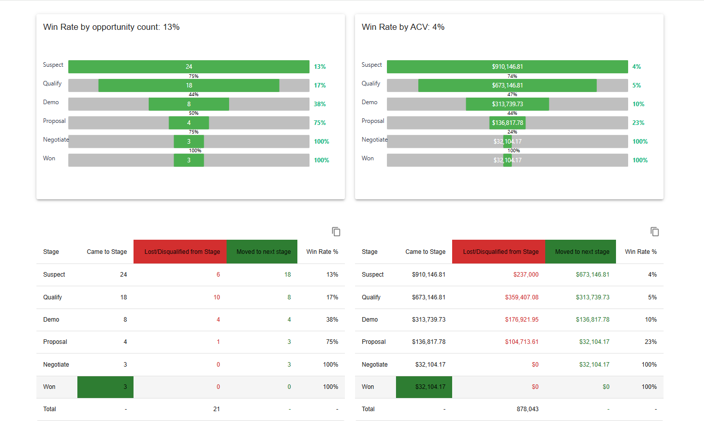

# Skygeni Project

Skygeni is a full-stack web visualization project built using **TypeScript**, **React.js**, **Material UI**, and **D3.js**, with a **Node.js** backend. The project visualizes opportunity stage metrics using a custom D3 bar graph and follows best practices in responsive design and clean architecture.

## 📊 Features

### ✅ Backend (Node.js / TypeScript)
- Reads data from a local JSON file
- Prepares and calculates values for UI display:
  - Win rate percentages (e.g. `Qualify / Suspect`, `Won / Suspect`)
  - Rounded values for display (e.g., `round(12.5) → 13%`)
- Serves data as an API response
- Organizes data to be frontend-ready

### ✅ Frontend (React + Vite + Material UI + D3.js)
- Consumes backend API and renders data dynamically
- Custom card UI built with Material UI
- Uses D3.js to render a dual-bar horizontal chart:
  - Grey bar for total
  - Green bar for win rate
  - Labels positioned responsively (inside/outside based on screen size)
- Fully responsive across:
  - Desktop / Laptop
  - Mobile
  - 4K Screens

---

## 📁 Folder Structure

```
skygeni-project/
├── server/               # Backend API and logic
│   ├── data.json         # Input data file
│   └── index.js          # API logic (reads data & sends response)
├── src/                  # Frontend React app
│   ├── components/       # Reusable components (cards, graph, etc.)
│   ├── store/            # Redux store and slices
│   └── App.tsx           # Main App component
├── index.html
├── package.json
├── vite.config.ts
├── tailwind.config.js
├── tsconfig.json
└── README.md
```

---

## 🚀 Getting Started

### 🔧 Prerequisites

- Node.js (v14+)
- npm or yarn

### Clone Repository 

```bash
git clone https://github.com/Tanishsingal/skygeni-project.git
```

### 📆 Install Dependencies

```bash
npm install
```

### ▶️ Run the Application

Start the  frontend :

```bash
npm run dev
```
Start the backend :

```bash
node ./server
```

> The app will be available at `http://localhost:5173`

### 🛠️ Build for Production

```bash
npm run build
```

---

## 📸 Preview

### Frontend Screenshot



_Above: Responsive D3.js chart embedded inside a Material UI card_

---

## 🔍 How It Works

### Backend Logic (Server)
- Parses `data.json`
- Calculates ratios like:
  - `Qualify / Suspect`
  - `Won / Suspect`
- Rounds off values (e.g., `round(12.5) → 13`)
- Structures and sends the processed data via API

### Frontend (React + Redux + D3.js)
- Fetches API data and stores it in Redux
- Renders data using:
  - Material UI card layout
  - D3.js chart with two bars:
    - Grey: total opportunity count or ACV
    - Green: win rate bar
- Adapts chart label positions based on screen size

---

## 🛠️ Tech Stack

- **Frontend**: React, TypeScript, Material UI, D3.js, Redux
- **Backend**: TypeScript, Node.js, Express (Vite-based dev server)
- **Build Tools**: Vite

---

## 🧠 Learnings & Highlights

- Hands-on with D3.js charting inside React
- Efficient data calculation on backend side
- Built a fully responsive data visualization card UI
- Enhanced TypeScript knowledge with modular architecture

---

## 🤝 Contributing

Pull requests and suggestions are welcome! please provide feedback 

---

